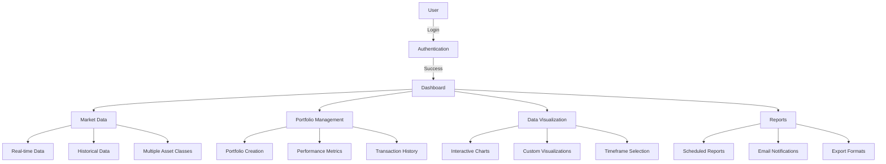

# Financial Dashboard Project Requirements Document

## 1. Project Overview
The Financial Dashboard is a production-ready web application that enables users to track market trends, manage portfolios, and analyze financial data through interactive visualizations. Built with scalability and performance in mind, it leverages modern technologies and best practices in full-stack development.

## 2. Application Flow

## 3. Technology Stack

### Backend
- **Framework**: FastAPI
- **Database**: PostgreSQL/MongoDB
- **Caching**: Redis
- **Task Queue**: Celery
- **API Documentation**: Swagger/OpenAPI

### Frontend
- **Framework**: React
- **State Management**: Redux
- **Visualization**: D3.js/Plotly
- **Styling**: Tailwind CSS

### Infrastructure
- **Containerization**: Docker
- **Orchestration**: Kubernetes
- **CI/CD**: GitHub Actions/Jenkins
- **Monitoring**: Prometheus/Grafana

## 4. System Architecture

### Core Components
1. **Authentication System**
   - JWT token based authentication
   - Role-based access control
   - Session management

2. **Market Data Integration**
   - Real-time data processing
   - Historical data storage
   - Multiple asset class support

3. **Portfolio Management**
   - Virtual portfolio tracking
   - Performance analytics
   - Transaction logging

4. **Data Visualization**
   - Interactive charting system
   - Custom visualization options
   - Timeframe selection

5. **Reporting System**
   - Scheduled report generation
   - Email notifications
   - Export functionality

## 5. Functional Requirements

### User Management
- Secure authentication system with JWT tokens
- Role-based access control (Admin/User)
- Customizable user profiles and preferences
- Session management and security features

### Market Data Integration
- Real-time market data from Alpha Vantage/Yahoo Finance APIs
- Historical data analysis and trending
- Support for multiple asset classes

### Portfolio Management
- Virtual portfolio creation and tracking
- Real-time portfolio valuation
- Performance metrics and analysis

### Data Visualization
- Interactive charts powered by D3.js/Plotly
- Multiple visualization types
- Customizable timeframes and indicators

### Automated Reporting
- Scheduled performance reports
- Email notifications
- Exportable reports in multiple formats

## 6. Non-Functional Requirements

### Performance
- API response time < 500ms for 95% of requests
- Dashboard load time < 2 seconds
- Support for 10,000 concurrent users

### Security
- HTTPS enforcement
- Data encryption at rest
- Regular security audits
- GDPR compliance

### Scalability
- Horizontal scaling support
- Auto-scaling based on load
- Distributed caching

### Reliability
- 99.9% uptime SLA
- Automated failover
- Disaster recovery plan

## 7. Development Process

### Code Quality
- Backend: Black formatter, isort for imports
- Frontend: ESLint, Prettier
- Pre-commit hooks

### Testing Strategy
- Unit tests for all components
- Integration tests for API endpoints
- Load testing for performance validation
- Security testing for vulnerabilities

### Deployment Process
- Continuous Integration/Continuous Deployment
- Blue-Green deployment strategy
- Automated rollback on failure

### Monitoring
- Real-time performance monitoring
- Error tracking and alerting
- Usage analytics
